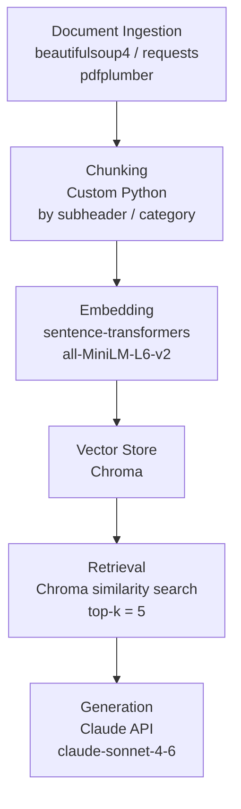

# Project 1 Planning: The Unofficial Guide

> Write this document before you write any pipeline code.
> Your spec and architecture diagram are what you'll use to direct AI tools (Claude, Copilot, etc.) to generate your implementation — the more specific they are, the more useful the generated code will be.
> Update the Retrieval Approach and Chunking Strategy sections if you change your approach during implementation.
> Update this file before starting any stretch features.

---

## Domain

<!-- What domain did you choose? Why is this knowledge valuable and hard to find through official channels? -->
My domain is off-campus housing handbook. It includes step-by-step guides on how to calculate what you can afford, considering hidden costs like utilities, deposits, and parking. It has explanations of lease terms (like joint vs. individual leases), how a guarantor works, and what to watch out for before signing. It also summaries of local laws outlining what a landlord is legally required to provide (like timely repairs) and what your obligations are as a tenant. User will can also find tips on avoiding rental scams, securing your apartment, and registering guests and advice on finding roommates, setting up chore charts, and drafting roommate agreements. Finding off-campus housing handbooks through official university channels is difficult because institutions intentionally distance themselves from the private rental market to avoid legal liability If a school endorses specific landlords or properties, they risk being blamed for lease disputes, scams, or poor living conditions.
---

## Documents

<!-- List your specific sources: URLs, subreddit names, forum threads, or file descriptions.
     Aim for at least 10 sources that together cover different subtopics or perspectives within your domain. -->

| # | Source | Description | URL or location |
|---|--------|-------------|-----------------|
| 1 | Redfin Blog | A student's guide on how to find off-campus housing | https://www.redfin.com/blog/how-to-find-off-campus-housing/  |
| 2 | Redfin Blog | How to rent an apartment as an international student study in the USA| https://www.redfin.com/blog/international-student-renting-guide/ |
| 3 | Find My Place | 9 best ways students can find off-campus housing near their university in 2026 | https://findmyplace.co/blog/find-off-campus-housing-near-university-2026/ |
| 4 | Tuition Rewards | Tips for finding off-campus housing | https://www.tuitionrewards.com/newsroom/articles/570/tips-for-finding-off-campus-housing |
| 5 | Apartments.com | 11 tips for first time renters | https://www.apartments.com/blog/first-time-apartment-renter-tips |
| 6 | Texas Apartment Association | Everything you need to know about lease termination | https://www.taa.org/resources/lease-termination/ |
| 7 | Texas Apartment Association | Explaining the process for applying for rental housing | https://www.taa.org/resources/applying-for-rental-housing/ |
| 8 | Apartments.com | A roommate considerations checklist | `documents/roommate-considerations-checklist.pdf` |
| 9 | Detb.org | Ways to save money in college | https://www.debt.org/students/college-budgeting-101/ |
| 10 | Texas Apartment Association | A list of assisstance available when you have trouble paying rent | https://www.taa.org/resources/rental-assistance/ |

---

## Chunking Strategy

<!-- How will you split documents into chunks?
     State your chunk size (in tokens or characters), overlap size, and explain why those
     numbers fit the structure of your documents.
     A review-heavy corpus warrants different chunking than a long FAQ. -->

**Chunk size:** 150–250 tokens for blog articles; 60–120 tokens for the checklist PDF (source 8)

**Overlap:** 30-50 tokens

**Reasoning:**
The blog articles (sources 1–7, 9–10) are structured with subheaders, where each section
contains a short intro paragraph and a bullet list covering one focused topic (e.g., "Watch
out for hidden fees" or "Inspect the property condition"). Each of these sections averages
150–250 tokens and represents a complete, self-contained idea that maps directly to the
kinds of questions a user would ask. Chunking at the subheader level keeps each chunk
topically coherent and avoids merging unrelated sections together.

The roommate considerations checklist PDF (source 8) is already pre-divided into labeled
categories (e.g., Lifestyle, Chores, Guests/Visitors, Pets, Parking). Each category is chunked
as a unit, keeping the "ask yourself" and "ask your potential roommate" questions for the
same category together. This preserves the self-reflection and conversation-starter pairing
that makes the checklist useful as a retrieval result.

An overlap of 30–50 tokens (~1–2 sentences or the final bullet of the preceding section)
handles cases where a closing sentence in one section introduces the next topic, ensuring
no bridging context is lost between chunks.

Each chunk will be tagged with its source URL (or file path for source 8) and a topic label
(e.g., `budgeting`, `lease`, `roommates`, `scams`) at ingestion time to improve retrieval
precision and avoid returning duplicate chunks from the same domain.
---

## Retrieval Approach

<!-- Which embedding model are you using (e.g., all-MiniLM-L6-v2 via sentence-transformers)?
     How many chunks will you retrieve per query (top-k)?
     If you were deploying this for real users and cost wasn't a constraint, what tradeoffs
     would you weigh in choosing a different embedding model — context length, multilingual
     support, accuracy on domain-specific text, latency? -->

**Embedding model:** `all-MiniLM-L6-v2` via `sentence-transformers`

**Top-k:** 5

**Production tradeoff reflection:**
`all-MiniLM-L6-v2` is a practical choice for this project — it's lightweight, fast, and
handles general English prose well. However, in a real deployment with no cost constraint,
several tradeoffs would be worth evaluating:

- **Context length:** `all-MiniLM-L6-v2` has a 256-token limit, which fits our 150–250
  token chunks comfortably. A model like `text-embedding-3-large` (OpenAI) or
  `nomic-embed-text` supports longer contexts, which would matter if chunks were larger
  or if we embedded entire sections at once.

- **Accuracy on domain-specific text:** Housing and rental terminology (e.g., "security
  deposit," "co-signer," "lease termination") is common enough that a general-purpose
  model handles it reasonably well. For a more specialized domain (e.g., medical or legal),
  a domain-fine-tuned model would meaningfully outperform MiniLM.

- **Multilingual support:** Source 2 targets international students, and real users may
  query in languages other than English. A model like `paraphrase-multilingual-MiniLM-L12-v2`
  or `multilingual-e5-large` would be worth the added size and latency for that use case.

- **Latency vs. accuracy:** Larger models like `bge-large-en-v1.5` or OpenAI's
  `text-embedding-3-large` produce more accurate embeddings but take longer to run at
  query time. For a student housing assistant with relatively simple queries, the accuracy
  gain may not justify the latency cost.

**Why top-k = 5:** Retrieving 5 chunks gives the LLM enough context to synthesize an
answer that draws on multiple relevant subtopics (e.g., a question about moving in might
touch on security deposits, property inspection, and hidden fees) without flooding the
context window with noise. Too few chunks (k=1–2) risks missing relevant information
when a query spans multiple sections; too many (k=10+) risks diluting the relevant
content with loosely related chunks, which can confuse the model or push the most
relevant content out of focus.

**Why semantic search works without exact word matches:** Embedding models map text
into a high-dimensional vector space where meaning is encoded geometrically — chunks
and queries that share the same concept end up close together even when the words
differ. For example, a query like "what should I check before signing?" will retrieve chunks
about lease agreements and hidden fees because the model has learned that "signing" and
"lease agreement" are semantically related, even if the word "signing" never appears in
the chunk.
---

## Evaluation Plan

<!-- List your 5 test questions with their expected correct answers.
     Questions should be specific enough that you can judge whether the system's response
     is right or wrong. "What are good dining halls?" is too vague.
     "What do students say about wait times at [dining hall name] during lunch?" is testable. -->

| # | Question | Expected answer |
|---|----------|-----------------|
| 1 | How much income do I need to qualify to rent an apartment on my own? | Landlords typically require verifiable income of at least 3x the monthly rent. If you don't meet that threshold, a co-signer can satisfy the requirement on your behalf.  |
| 2 | What should I look for when inspecting an apartment before moving in? | Check for structural issues (cracks, water stains), test all appliances and plumbing, verify electrical outlets work, and look for signs of pests. Photograph or video any existing damage before signing. |
| 3 | What fees beyond monthly rent should I ask about before signing a lease? | Ask about application fees, pet fees or deposits, parking fees, amenity fees (gym, pool), and early termination fees. Request a full written breakdown before committing. |
| 4 | What are the warning signs that a rental listing might be a scam? | Red flags include rent that seems unusually low, a landlord who is out of the country and can't show the property, requests for money before you've seen the unit or signed a lease, and listings with vague descriptions or low-quality photos. |
| 5 | How to find a compatible roommate? | Use a checklis of roommate lifestyle questions to discuss before moving
   in together. |

---

## Anticipated Challenges

<!-- What could go wrong? Name at least two specific risks with reasoning.
     Consider: noisy or inconsistent documents, missing source attribution, off-topic
     retrieval, chunks that split key information across boundaries. -->

1. **Cross-section queries triggering off-topic retrieval.** Several questions (like Q3 above)
   span topics that are covered in separate chunks across multiple sources — for example,
   hidden fees appear in the Redfin blog, the TAA lease termination page, and the
   Apartments.com tips article. If the embedding for "fees" retrieves chunks about broker
   fees when the user is asking about move-out fees, the LLM may synthesize a partially
   wrong or incomplete answer. Mitigation: tag chunks with topic labels at ingestion and
   consider filtering by tag when the query intent is clearly scoped.

2. **Checklist chunks returning out of context.** The roommate checklist (source 8) is
   structured as bare questions with no explanatory prose. If a user asks something like
   "what should I think about before getting a roommate?", the retriever may surface a
   chunk of disconnected questions (e.g., "Are you a night owl or an early bird? Is smoking
   an issue?") without any framing. The LLM would need to synthesize those into a coherent
   answer rather than just relay them, which increases the chance of a confusing or
   incomplete response. Mitigation: prepend each checklist chunk with a short context
   sentence (e.g., "The following are roommate lifestyle questions to discuss before moving
   in together:") during ingestion so the chunk is self-explanatory when retrieved.

---

## Architecture

<!-- Draw a diagram of your pipeline showing the five stages:
     Document Ingestion → Chunking → Embedding + Vector Store → Retrieval → Generation
     Label each stage with the tool or library you're using.
     You can use ASCII art, a Mermaid diagram, or embed a sketch as an image.
     You'll use this diagram as context when prompting AI tools to implement each stage. -->

**Stage notes:**
- **Ingestion:** Web sources (sources 1–7, 9–10) are fetched and parsed with `requests` +
  `beautifulsoup4` to extract clean body text. The checklist PDF (source 8) is parsed with
  `pdfplumber`. Each document is stored with its source URL or file path as metadata.
- **Chunking:** Blog articles are split at subheader boundaries, targeting 150–250 tokens
  per chunk. The checklist PDF is split by category label. Each chunk is tagged with
  `source`, `url`, and `topic` metadata.
- **Embedding:** Chunks are embedded using `all-MiniLM-L6-v2` via `sentence-transformers`
  and stored as vectors in Chroma.
- **Retrieval:** At query time, the user's question is embedded with the same model and
  the top 5 most similar chunks are retrieved from Chroma.
- **Generation:** Retrieved chunks are injected into a prompt as context and passed to
  the Claude API, which generates a grounded answer.
---

## AI Tool Plan

<!-- For each part of the pipeline below, describe:
     - Which AI tool you plan to use (Claude, Copilot, ChatGPT, etc.)
     - What you'll give it as input (which sections of this planning.md, which requirements)
     - What you expect it to produce
     - How you'll verify the output matches your spec

     "I'll use AI to help me code" is not a plan.
     "I'll give Claude my Chunking Strategy section and ask it to implement chunk_text()
     with my specified chunk size and overlap" is a plan. -->

| Stage | AI Tool | Input I'll provide | Expected output | How I'll verify |
|---|---|---|---|---|
| Ingestion | Claude | List of URLs and file paths from the Documents table; chunk size and metadata requirements from the Chunking Strategy section | Python script using `requests`, `beautifulsoup4`, and `pdfplumber` to fetch and clean each source and return a list of `{text, source, url, topic}` dicts | Manually inspect 2–3 outputs per source type to confirm text is clean (no nav bars, footers, or HTML tags) and metadata fields are populated |
| Chunking | Claude | Ingestion output format; chunking rules from the Chunking Strategy section (subheader split for blogs, category split for checklist, 150–250 token target) | Python function that takes a document dict and returns a list of chunk dicts with `text`, `token_count`, `source`, and `topic` | Print token counts for every chunk and assert none exceed 256; spot-check that subheader boundaries are respected |
| Embedding + Vector Store | Claude | Chunk output format; model name (`all-MiniLM-L6-v2`); Chroma setup requirements | Python script that embeds all chunks and upserts them into a local Chroma collection with metadata | Query Chroma directly with a known phrase and confirm the expected chunk is in the top 3 results |
| Retrieval | Claude | Chroma collection setup; top-k = 5; query format | Python function that takes a query string and returns the top 5 matching chunks with their text and metadata | Run all 5 evaluation questions from the Evaluation Plan and confirm the expected source appears in retrieved chunks |
| Generation | Claude | Retrieved chunk format; system prompt specifying the assistant's role and grounding rules | Python function that formats chunks into a prompt and calls the Claude API, returning a grounded answer | Compare generated answers against expected answers in the Evaluation Plan; flag any answer that introduces facts not present in the retrieved chunks |

**Milestone 3 — Ingestion and chunking:**

**Milestone 4 — Embedding and retrieval:**

**Milestone 5 — Generation and interface:**
